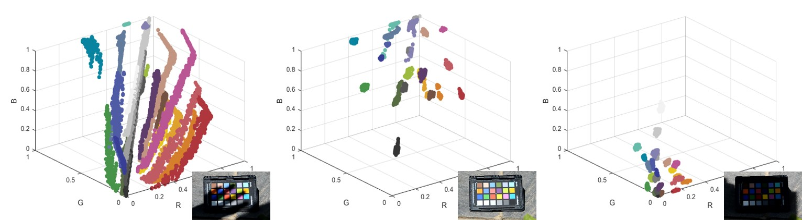
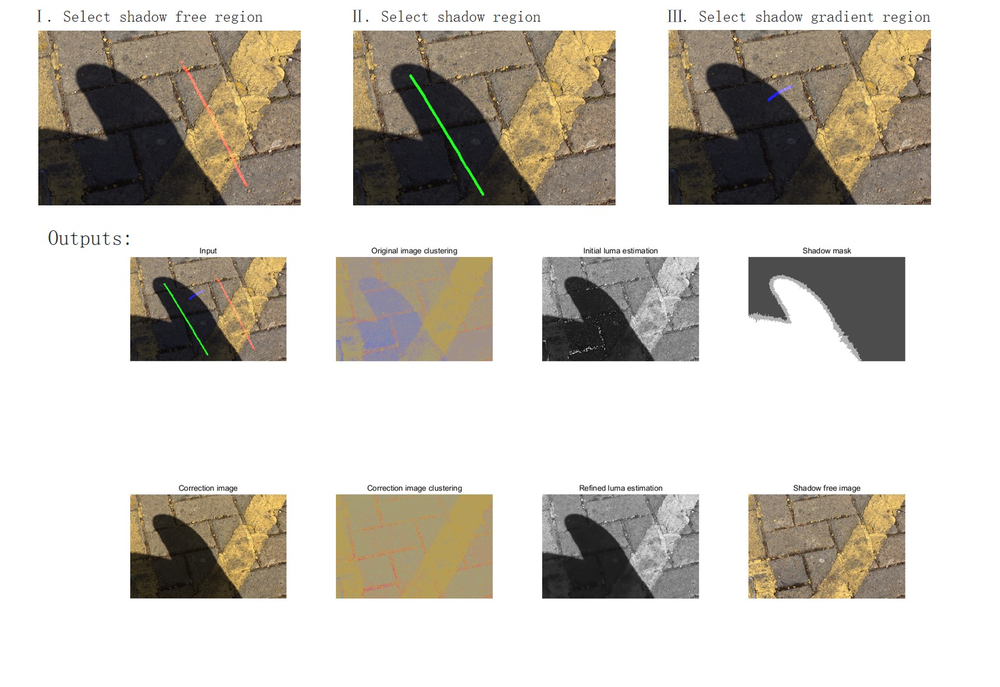
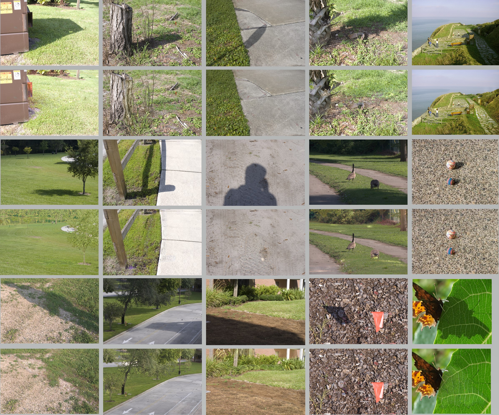

# Shadow Removal using Color-Lines
Code for the paper "A New Shadow Removal Method using Color-Lines", International Conference on Computer Analysis of Images and Patterns (CAIP), 2017.
<p align="center"></p>

## Getting Started
### Requirement
This code was tested on MATLAB 2016b on x64 windows.
### Usage
demo.m presents a simple interaction for shadow removal. 
<p align="center"></p>

You can deshadow your image with the following script:
```
img_shadow = im2double(imread('PHOTO_PATH'));
img_deshadow = shadowRemoval(img_shadow);
```
## Results
<p align="center"></p>

#### bibtex

>    @inproceedings{yu2017shadow,    
>      title={A New Shadow Removal Method using Color-Lines},    
>      author={Yu, Xiaoming and Li, Ge and Ying, Zhenqiang and Guo, Xiaoqiang},    
>      booktitle={International Conference on Computer Analysis of Images and Patterns},    
>      year={2017},
>    }


### Contact
Feel free to reach me if there is any questions (Xiaoming-Yu@pku.edu.cn).


